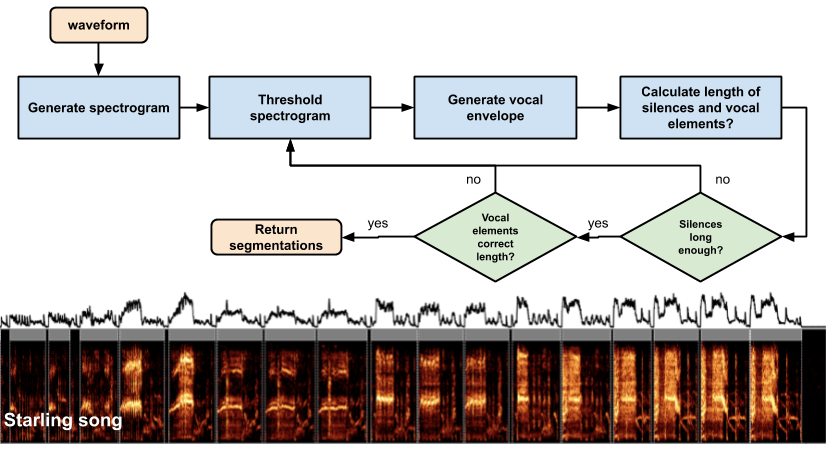
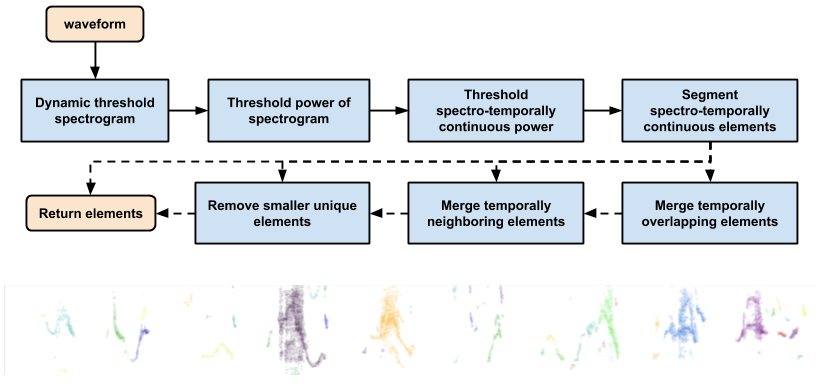

Vocalization segmentation
==============================

This is a set of simple algorithms for segmenting vocalizations without supervision using (many) parameters. It's basically meant as an easy dumb way of doing segmentation by eye so that you can repeat segmentation on many different vocalizations simultaneously using the same methods. 

There are a bunch of Jupyter notebook examples for European starlings, bengalese finch, canary, and mouse USVs. 

There are two main segmentation algorithms:

1) <b>Dynamic thresholding:</b> segments syllables in time by computing a spectral envelope and modifying the threshold for segmentation on that envelope based on a set of parameters.



2) <b>Continuous element segmentation:</b> segments elements of song spectro-temporally, so that two elements can be overlapping in time but not frequency. 




### Parameters

There are a whole bunch of different parameters for the two algorithms. Here is a quick description of each:

```
Arguments:
        vocalization {[type]} -- waveform of song
        rate {[type]} -- samplerate of datas

    Keyword Arguments:
        min_level_db {int} -- default dB minimum of spectrogram (threshold anything below) (default: {-80})
        min_level_db_floor {int} -- highest number min_level_db is allowed to reach dynamically (default: {-40})
        db_delta {int} -- delta in setting min_level_db (default: {5})
        n_fft {int} -- FFT window size (default: {1024})
        hop_length_ms {int} -- number audio of frames in ms between STFT columns (default: {1})
        win_length_ms {int} -- size of fft window (ms) (default: {5})
        ref_level_db {int} -- reference level dB of audio (default: {20})
        pre {float} -- coefficient for preemphasis filter (default: {0.97})
        spectral_range {[type]} -- spectral range to care about for spectrogram (default: {None})
        verbose {bool} -- display output (default: {False})
        mask_thresh_std {int} -- standard deviations above median to threshold out noise (higher = threshold more noise) (default: {1})
        neighborhood_time_ms {int} -- size in time of neighborhood-continuity filter (default: {5})
        neighborhood_freq_hz {int} -- size in Hz of neighborhood-continuity filter (default: {500})
        neighborhood_thresh {float} -- threshold number of neighborhood time-frequency bins above 0 to consider a bin not noise (default: {0.5})
        min_syllable_length_s {float} -- shortest expected length of syllable (default: {0.1})
        min_silence_for_spec {float} -- shortest expected length of silence in a song (used to set dynamic threshold) (default: {0.1})
        silence_threshold {float} -- threshold for spectrogram to consider noise as silence (default: {0.05})
        max_vocal_for_spec {float} -- longest expected vocalization in seconds  (default: {1.0})
        temporal_neighbor_merge_distance_ms {float} -- longest distance at which two elements should be considered one (default: {0.0})
        overlapping_element_merge_thresh {float} -- proportion of temporal overlap to consider two elements one (default: {np.inf})
        min_element_size_ms_hz {list} --  smallest expected element size (in ms and HZ). Everything smaller is removed. (default: {[0, 0]})
        figsize {tuple} -- size of figure for displaying output (default: {(20, 5)})

```

--------

<p><small>Project based on the <a target="_blank" href="https://drivendata.github.io/cookiecutter-data-science/">cookiecutter data science project template</a>. #cookiecutterdatascience</small></p>
